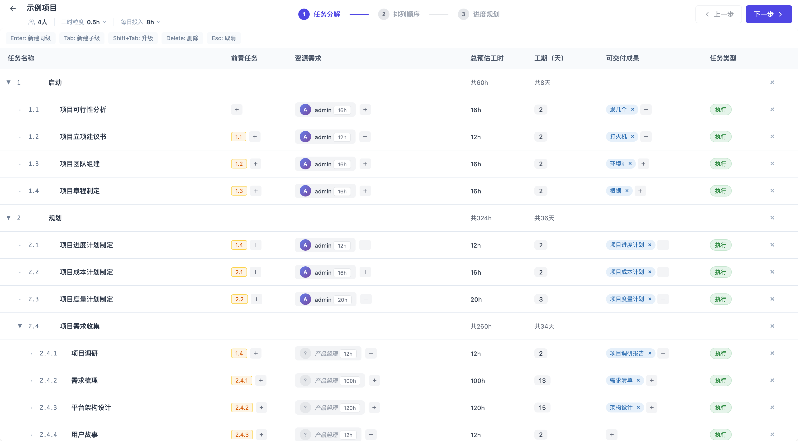
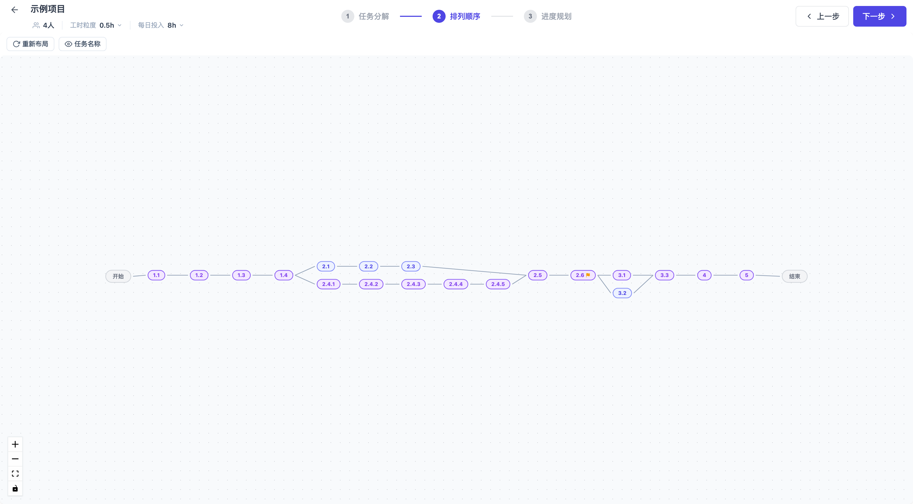
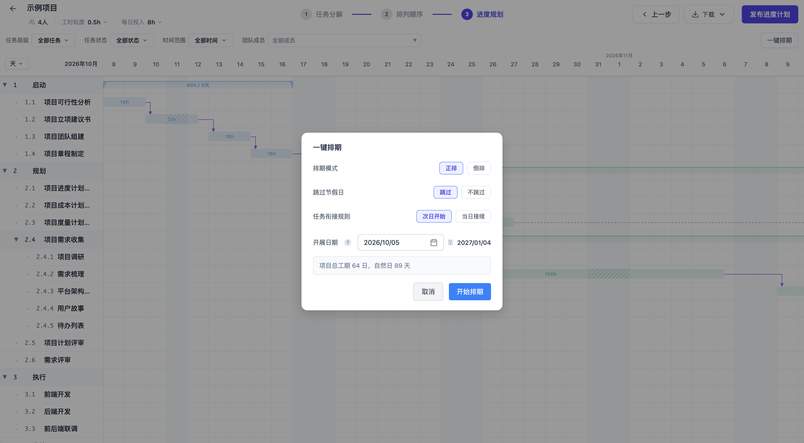
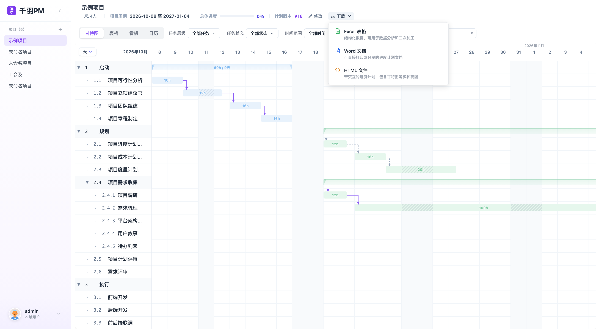
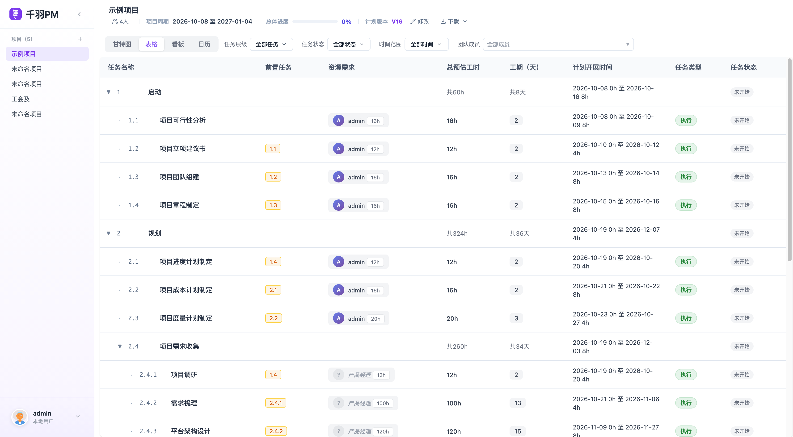
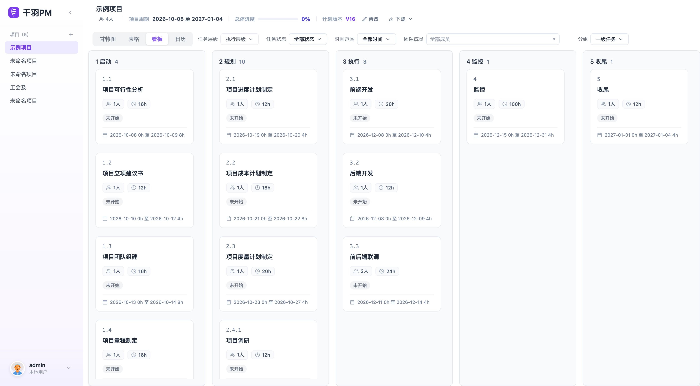
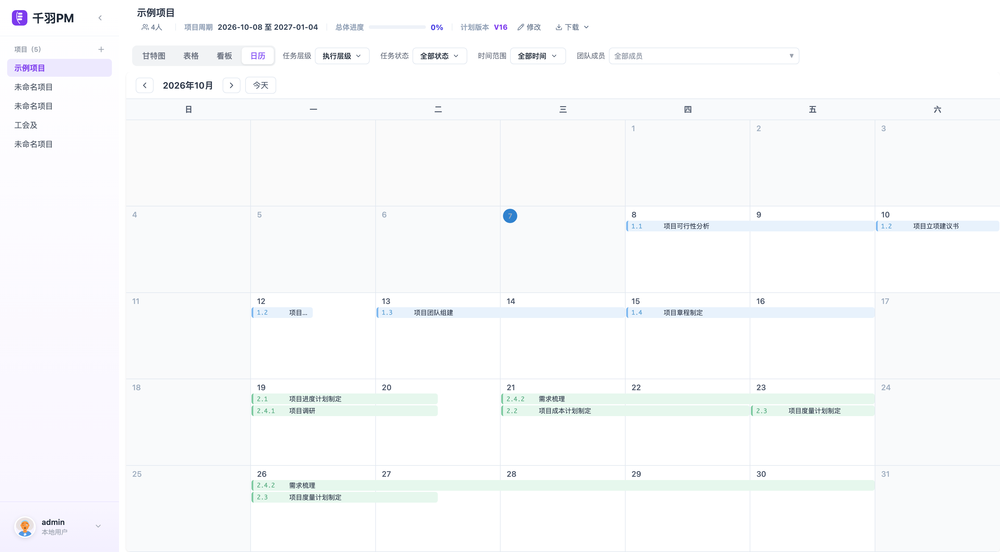

# 千羽PM（开源核心）

轻量级在线项目排期工具 —— 从任务分解到进度计划，操作更丝滑。

项目排期数据保存在浏览器（IndexedDB）中，不上传任何服务器，可随时导出备份。本仓库是千羽PM 的开源核心，包含完整的项目排期流程，`npm install && npm run dev` 即可本地运行。

## 功能一览

- **项目列表 / 项目主页**：多项目管理，主页汇总任务进度、成员与版本信息
- **任务分解（WBS）**：树形结构分解任务，支持子任务下钻、成员资源分配、工时预估、可交付成果登记
- **排列顺序**：网络图（React Flow）编辑任务前置依赖，自动布局，支持拖拽调整
- **进度规划**：甘特图排期 —— 一键排期、拖拽调整、前后置任务联动、节假日跳过、工时粒度设置、关键路径高亮
- **四视图联动**：任务分解 / 网络图 / 进度规划共享同一份数据，改一处处处同步
- **版本管理**：进度计划支持草稿与正式发布，发布后可回看历史版本、版本对比（待更新）
- **导出**：Excel（.xlsx）、Word（.docx，含横版任务明细附件）、HTML（可直接打开浏览的独立计划页）
- **数据本地化**：全部数据存储于浏览器 IndexedDB，支持本地文件夹备份

## 排期步骤示意

| 任务分解（WBS） | 排列顺序（网络图） | 进度规划（甘特图） |
| --- | --- | --- |
|  |  |  |

## 项目进度计划视图

进度计划支持四种视图，数据同源联动，任一视图调整实时同步：

| 甘特图 | 表格 |
| --- | --- |
|  |  |
| 看板 | 日历 |
|  |  |

## 快速开始

```bash
git clone https://github.com/daisy1995/qianyu-pm.git
cd qianyu-pm
npm install
npm run dev
```

浏览器打开 http://localhost:5173 即可使用。

> 要求 Node.js 18+。首次使用时在页面中新建项目，从「任务分解」开始你的排期流程。

## 数据存储与备份

- 所有数据保存在浏览器本地 IndexedDB（`PMflowDB`），**不会上传到任何服务器**
- 清除浏览器数据会丢失本地数据，请使用侧栏底部菜单的「清除数据」谨慎操作，重要计划请定期通过导出功能备份
- 项目数据与浏览器 origin 绑定：换浏览器 / 换端口访问属于不同数据空间

## 开源版与官方版

| | 开源版（本仓库） | [官方版](https://www.qianyupm.top/) |
| --- | --- | --- |
| 使用方式 | 克隆代码本地运行 | 浏览器直接访问，免安装，在线使用 |
| 数据存储 | 本地 IndexedDB | 本地 + 云同步服务（可选） |
| 更新 | 跟随仓库发布 | 持续更新 |

## 技术栈

React 18 · Vite 5 · React Router 7 · React Flow 11 · dagre · Tiptap · exceljs · docx

## 目录结构

```
├── index.html
├── package.json
├── vite.config.js
├── docs/screenshots/     # README 截图
└── src/
    ├── App.jsx           # 应用主体（路由 / 排期状态 / 版本管理）
    ├── createApp.jsx     # 应用组装入口（扩展点）
    ├── components/       # 页面与业务组件
    └── utils/            # db（IndexedDB）/ 排期引擎 / 导出器 / 版本比对
```

## License

本项目基于 [AGPL-3.0](LICENSE) 协议开源。基于本项目的网络服务需遵守协议开源相应修改；如需商业授权闭源集成，请通过[官网](https://www.qianyupm.top/)联系开发者。
